# How to generate the history of Context Information using STH-Comet

Context Information stored by the FIWARE Context Broker only includes the latest value of entity attributes. In order to be able to register the history of attribute values, the STH-Comet component is needed. STH Comet allows to generate "historical raw and aggregated time series context information", using a historic database built on top of MongoDB.

Therefore, the three main components used are:
* [Orion Context Broker](https://fiware-orion.readthedocs.io/en/master/ "OrionCB Documentation")
* [STH-Comet](https://fiware-sth-comet.readthedocs.io/en/latest/ "STH-Comet Documentation")
* [MongoDB](https://docs.mongodb.com/ "MongoDB Documentation")

In the figure below we can see that the user can issue REST HTTP requests. All operations are sent to the Orion Context Broker to be processed. STH subscribes to Orion Context Broker, so that STH is notified of any change made to entities stored by Orion. As a result STH is capable of generating the historical database.

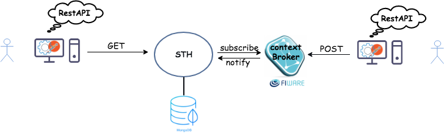

To walk through this tutorial you need to make sure that you have docker and docker compose running on your machine. Please, follow the installation process for docker [here](https://docs.docker.com/install/) and for docker-compose [here](https://docs.docker.com/compose/install/) based on your operating system.

After ensuring that you have docker and docker-compose running on your machine. You need to make a directory and to create a  docker-compose.yml file as in the example below.

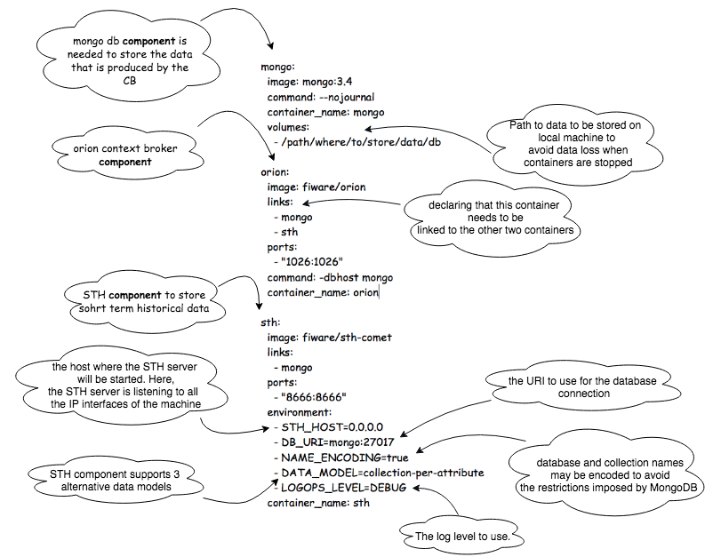

In the previous example we have various applications on various containers, all of those containers are actually linked together, and you don’t want to execute each of those containers one by one but you want to run those containers at once with a single command. So that’s where [docker compose](https://docs.docker.com/compose/compose-file/#service-configuration-reference) comes to the picture, with docker compose we can actually run multiple applications, present in various containers, with one single command “docker-compose up”. As you can see in the example above, we are able to define three containers; one running an Orion Context Broker, one running a MongoDB and another running an STH-Comet in a *.yml file, that is called “docker-compose” file.

You need to notice in the previous figure that the STH component allows the user to configure the component using *.conf file or *.js, but if we set environment variables then it has the precedence over other configurations set in one of the files. [Here](https://fiware-sth-comet.readthedocs.io/en/latest/running/index.html?q=DB_URI&check_keywords=yes&area=default)  you can find more information about the STH environment variables.

# Running The Example

The steps that are going to be taken are the following:

* Run the docker compose (*.yml) file
* Publish Context Information to Orion Context Broker (CB)
* Create a Subscription to notify the STH
* Update values in different periods of time
* Retrieve time series and aggregated data

## **Step by step:**

Remove all docker containers (optional)

 ```console
$ docker rm `docker ps -aq`
```

Remove all docker images (optional)

```console
$ docker rmi $(docker images -a -q)
```

To run the 3 components together (MongoDB-orionCB-STH), you need to change to the directory containing the folder that has the docker-compose.yml file, then you run the following docker-compose command:

```console
$ docker-compose up
```

To check the images built on your local machine

```console
$ docker images

REPOSITORY          TAG                 IMAGE ID            CREATED             SIZE
fiware/orion        latest              d6ff87a7b412        6 days ago          266MB
mongo               3.4                 baea457313ee        3 weeks ago         360MB
fiware/sth-comet    latest              6915eeff95d3        4 months ago        294MB
```

To check the current running containers

```console
$ docker ps

CONTAINER ID        IMAGE               COMMAND                  CREATED                  STATUS              PORTS                    NAMES
ccb6441ba878        fiware/orion        "/usr/bin/contextBro…"   Less than a second ago   Up 10 seconds       0.0.0.0:1026->1026/tcp   orion
c832cb36bdfc        fiware/sth-comet    "/bin/sh -c bin/sth"     Less than a second ago   Up 10 seconds       0.0.0.0:8666->8666/tcp   sth
44dea317f258        mongo:3.4           "docker-entrypoint.s…"   Less than a second ago   Up 11 seconds       27017/tcp                mongo

```

We see that the three containers are running now. Here, we can notice that the Orion Context Broker application is running on port 1026 as we specified in the “docker-compose.yml” file, as well as the STH application is running on the port 8666, and MongoDB is running on port 27017.

To make REST API Calls:
There are many HTTP clients that can help you quickly test web services.

* Postman application: http://www.getpostman.com/
* Command Line using curl: https://curl.haxx.se/docs/httpscripting.html

In our example we are using Postman to perform CRUD (Create, Remove, Update, Delete) operations.

In order to check if the Orion Context Broker and the STH are really working and responsive we can test by querying the version for each and check if we get an answer.

Once we open postman we need to specify that we need to do a GET query and we need to specify the target (URI:port), in our case the queried target is as follows:

> curl --request GET \ --url http://localhost:1026/version

```json
{
    "orion": {
        "version": "1.12.0-next",
        "uptime": "4 d, 0 h, 3 m, 33 s",
        "git_hash": "61d067e1e82a3b59aa3971b129a97d9814259627",
        "compile_time": "Thu Mar 1 17:52:25 UTC 2018",
        "compiled_by": "root",
        "compiled_in": "0b718d526f33",
        "release_date": "Thu Mar 1 17:52:25 UTC 2018",
        "doc": "https://fiware-orion.readthedocs.org/en/master/"
    }
}
```

> curl --request GET \ --url http://localhost:8666/version

```json
{
    "version": "2.3.0-next"
}
```

Now, to check whether the DB is accessible as well, we need to connect to MongoDB container and execute the mongo command to access the mongo shell.

```console
$ docker exec -it mongo mongo
```

MongoDB shell version v3.4.13
connecting to: mongodb://127.0.0.1:27017
MongoDB server version: 3.4.13
Welcome to the MongoDB shell.
For interactive help, type "help".
For more comprehensive documentation, see
	http://docs.mongodb.org/
Questions? Try the support group
	http://groups.google.com/group/mongodb-user
Server has startup warnings: 
2018-03-08T11:50:52.662+0000 I STORAGE  [initandlisten] 
2018-03-08T11:50:52.662+0000 I STORAGE  [initandlisten] ** WARNING: Using the XFS filesystem is strongly recommended with the WiredTiger storage engine
2018-03-08T11:50:52.662+0000 I STORAGE  [initandlisten] **          See http://dochub.mongodb.org/core/prodnotes-filesystem
2018-03-08T11:50:52.764+0000 I CONTROL  [initandlisten] 
2018-03-08T11:50:52.765+0000 I CONTROL  [initandlisten] ** WARNING: Access control is not enabled for the database.
2018-03-08T11:50:52.765+0000 I CONTROL  [initandlisten] **          Read and write access to data and configuration is unrestricted.
2018-03-08T11:50:52.765+0000 I CONTROL  [initandlisten] 
>
```

```console
> show dbs
admin  0.000GB
local  0.000GB
orion  0.000GB
```

## Operations on Entities

As entity is an object stored by the Context Broker. Each entity has one or more attributes. We can read, update, subscribe to one of these attributes in order to be notified once a values has been changed. The operations that we can perform on the entities are Post, Get, Put, Delete.

### Create Entity

We need to perform a POST request to the following target as follows:

> localhost:1026/v2/entities

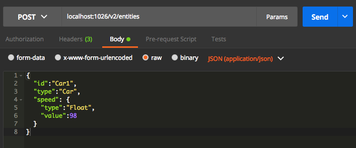

We need to specify some header values too when sending the request:


“Content-type” is to specify the type of data that we want to send, always application/json.

`Fiware-Service` and `FiwareServicepath` are intended to the logical separation of the data, this is called multi-tenant model, this term refers to software architecture in which a single instance of software runs on a server and serves multiple tenants. For example; `Fiware-Service`: Tenant1. Also, a service path is a hierarchical scope assigned to an entity at creation time. For example; `Fiware-ServicePath`: /some/hierarchical/path.

_Note: these headers need to be set for all the operations we perform in this example._

### Add more than one entity

We need to do a POST request to the following target

> localhost:1026/v2/**op/update**

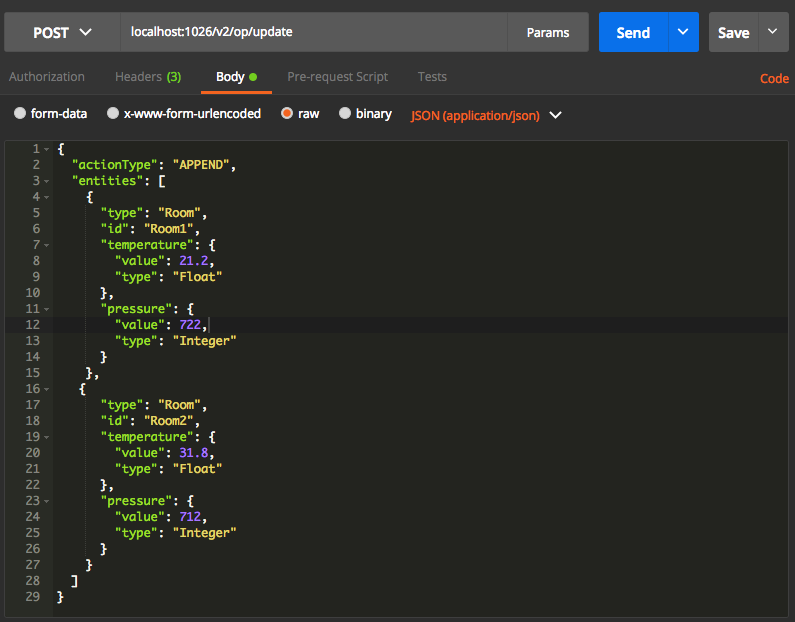

### Query all registered entities

To query all entities that have been created we need to perform a GET operation to the following target (the query should retrieve all previous entities we added previously)

> localhost:1026/v2/entities

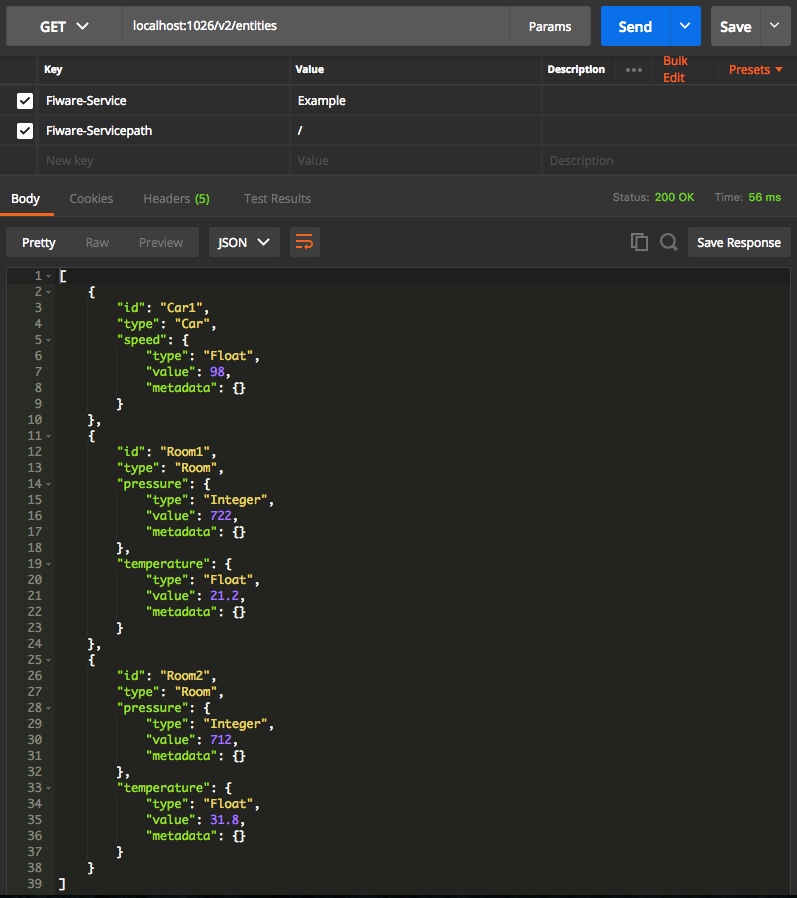

## Operations on Attributes

Entity attributes can be addressed individually. The operations include: get attribute, put attribute, get value of an attribute, put value for specific attribute, and delete an attribute.

### Modify an Attribute

In our case we want to modify the attribute value for the Car1 entity, this can be done by performing a PUT request to the following target with the same 3 headers parameters we passed previously

> localhost:1026/v2/entities/Car1/attrs/speed/value

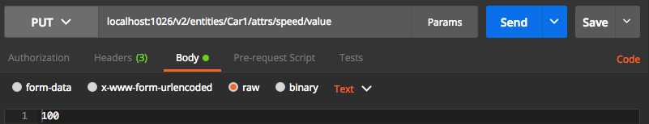

## Subscribe STH to Orion

Context Consumers can subscribe to receive context information that satisfy certain conditions using the subscribe operation. Such subscriptions may have an expiration time. In return, the Context Broker notifies updates on context information to subscribed Context Consumers by invoking the notify operation they export.

The `entities` and `notifications` subfields define the contents of the notification messages.

* `idPattern` is used to filter which entities we want. Its value is a regular expression. In our example we set it to retrieve all.
* The `url` where to send notifications is defined with the  url sub-field. Here we specified the url of the STH-Comet.
* `attrsFormat`: we set it to legacy because the STH only understands NGSI v1 notification payloads.
* Subscriptions may have an expiration date expires field, specified using the ISO 8601 standard format. Once subscription overpass that date, the subscription is simply ignored.

> localhost:1026/v2/subscriptions


After creating a subscription we need to update the attribute values the same way we did before to be able to query some aggregations using the STH API. To see changes we need to update the attribute value at different points in time, the following example shows how we can change an attribute value several times

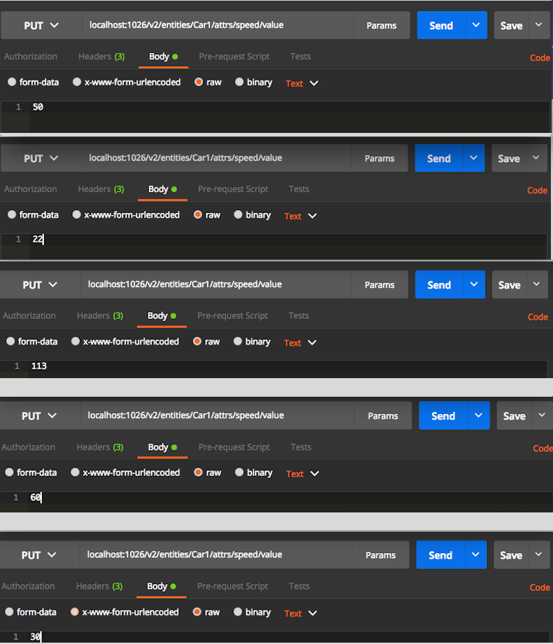

## Query Time Series Values

Here we will query, through the STH, all the raw data for the values that have been changed. therefore we need to perform GET operation for the following target:

> localhost:8666/STH/v1/contextEntities/type/Car/id/Car1/attributes/speed?lastN=20

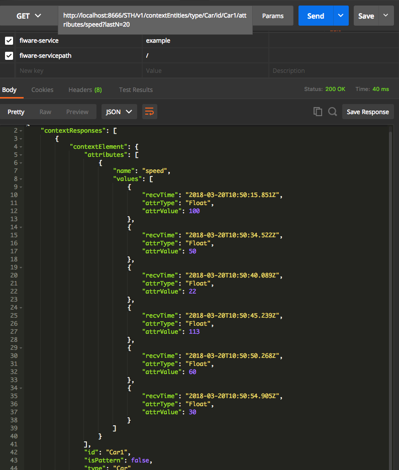


In the response payload we can see that the name of the changed attribute is `speed`, followed by the values that have been changed within different time periods. For example, we can see that the timestamp corresponding to the speed value of 22 is `2018-03-05T12:00:56:728Z`.

## Resolution and Aggregation

**aggrMethod:** The aggregation method. The STH component supports the following aggregation methods: _max_ (maximum value), _min_ (minimum value), _sum_ (sum of all the samples) and sum2 (sum of the square value of all the samples) for numeric attribute values and occur for attributes values of type string.

**aggrPeriod:** Aggregation period or resolution. A fixed resolution determines the origin time format and the possible offsets. It is a mandatory parameter. Resolution or aggregation period is the time period by which the aggregated time series information is grouped. Possible valid resolution values supported by the STH are: month, day, hour, minute and second.
Note: In our example, aggregated time series context information is set to a resolution of minutes because we are (manually) performing changes on attribute’s value in seconds. Therefore,  if values are changing in an hourly manner then we set the aggregated time period parameter to day so we can see the underlying hourly changes.

For more info you can go the the [STH-Comet documentation](https://fiware-sth-comet.readthedocs.io/en/latest/getting-started/index.html "Resolution&Aggregation query parameters documentation").

###  Retrieve the Maximum Value

Here we perform a GET request to the following target

> localhost:8666/STH/v1/contextEntities/type/Car/id/Car1/attributes/speed?aggrMethod=**max**&aggrPeriod=**minute**&dateFrom=2018-03-08T00:00:00.000Z&dateTo=2018-03-08T23:59:59.999Z

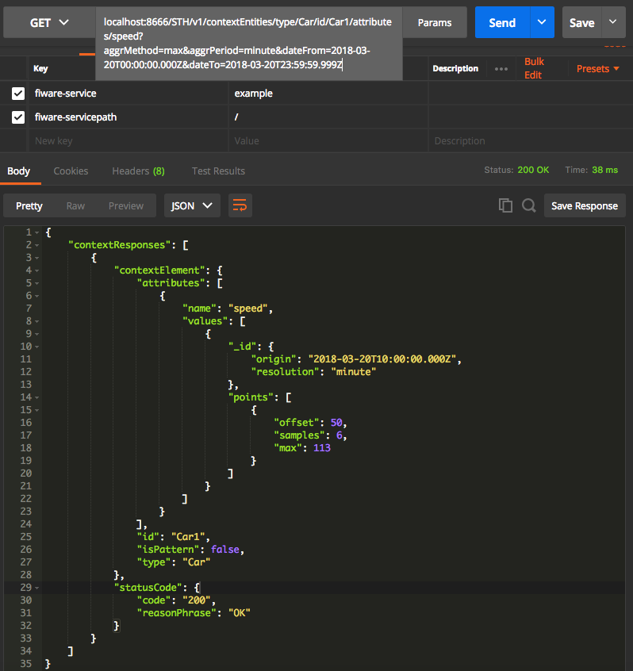

In this example, we can see that the resolution that we are performing our queries at is in _minutes_. Therefore when querying the maximum number for an attribute we will have a maximum value for each minute. We can see that the origin time is `2018-03-08T12:00:00:000Z` .In our example we see that in the minute 47 we have 2 samples and the maximum number is 50. Whereas, in the minute 48 we have 10 samples and the maximum value is 100.

### Retrieve Occurrences

Here we perform a GET request to the following target

> localhost:8666/STH/v1/contextEntities/type/Car/id/Car1/attributes/speed?aggrMethod=**occur**&aggrPeriod=**minute**&dateFrom=2018-03-08T00:00:00.000Z&dateTo=2018-03-08T23:59:59.999Z

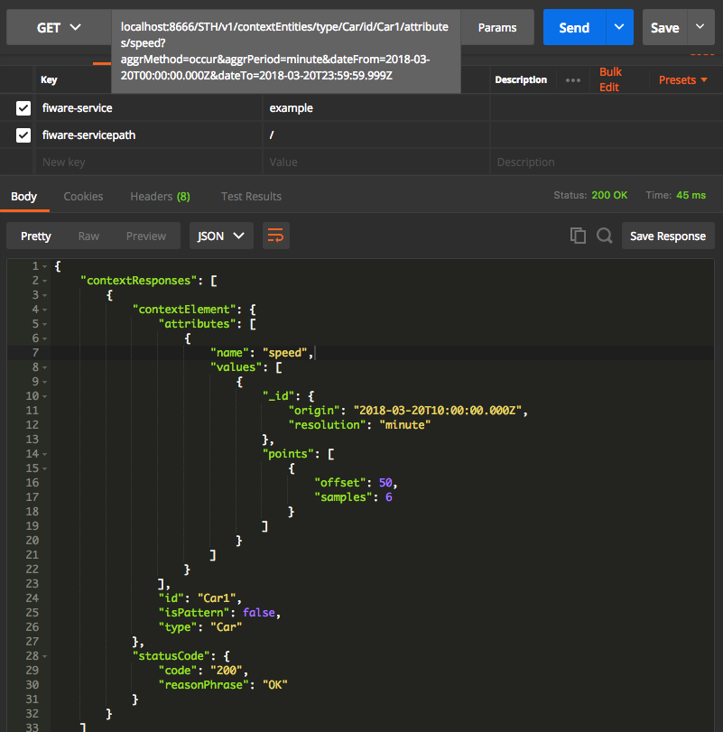

In the picture we can see that for the hour 11:00 and minute 58 we have only 1 sample that has occurred. Whereas, for the hour 12:00 and minute 1 we have 3 samples that have occurred.

### Retrieve the Sum

Here we perform a GET request to the following target

> localhost:8666/STH/v1/contextEntities/type/Car/id/Car1/attributes/speed?aggrMethod=**sum**&aggrPeriod=**minute**&dateFrom=2018-03-08T00:00:00.000Z&dateTo=2018-03-08T23:59:59.999Z

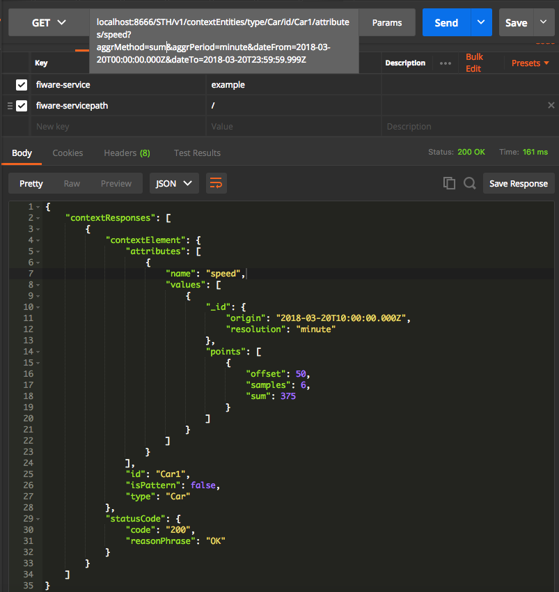

We can calculate the average by combining the information provided by these aggregated methods with the number of samples. It is possible to calculate probabilistic values such as the average value, the variance as well as the standard deviation. It is a mandatory parameter. For instance, we can calculate manually the average by dividing the sum by the sample number.

## MongoDB historical output

We can connect to the MongoDB container and access all registered entities to the Orion Context Broker. We can check as well all historical data that has been generated

> docker exec -it mongo mongo

```console
> show dbs
admin          0.000GB
local          0.000GB
orion          0.000GB
orion-example  0.000GB
sth_example    0.001GB

> use orion-example
switched to db orion-example

> show collections
csubs
entities

> db.entities.count()
4

> use sth_example
switched to db sth_example

> show collections 
sth_x002fxffffCar1xffffCarxffffspeed
sth_x002fxffffCar1xffffCarxffffspeed.aggr
sth_x002fxffffCar2xffffCarxffffspeed
sth_x002fxffffCar2xffffCarxffffspeed.aggr
sth_x002fxffffRoom2xffffRoomxffffpressure
sth_x002fxffffRoom2xffffRoomxffffpressure.aggr
sth_x002fxffffRoom2xffffRoomxfffftemperature
sth_x002fxffffRoom2xffffRoomxfffftemperature.aggr
sth_x002fxffffRoom3xffffRoomxffffpressure
sth_x002fxffffRoom3xffffRoomxffffpressure.aggr
sth_x002fxffffRoom3xffffRoomxfffftemperature
sth_x002fxffffRoom3xffffRoomxfffftemperature.aggr

> db.sth_x002fxffffCar1xffffCarxffffspeed.count()
12
```