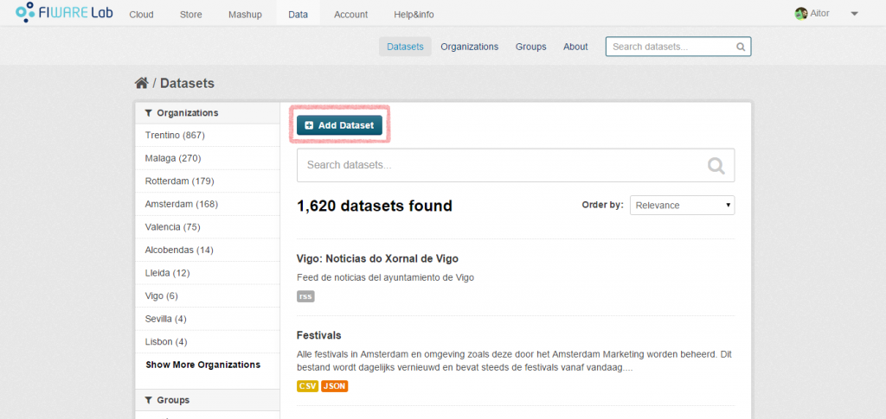
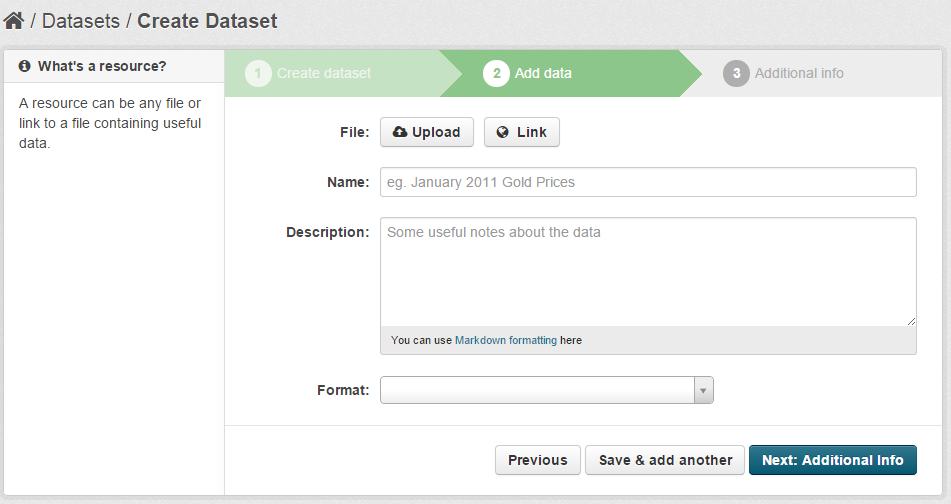

To upload your own datasets (open data) to CKAN, you must access the
[FIWARE Data portal](https://data.lab.fiware.org/). Once that you are
logged in, you should go to the “Datasets” section and click on the “Add
Dataset” button.

In the first step, you will have to provide some basic information such
as the name, the description or the tags of your dataset. In addition,
you will be asked for some additional information:

-   Visibility: if you choose “Public”, all the users (even those that
    are not logged in) will be able to access the dataset. Otherwise,
    only some selected users will be able to access the dataset.
-   Searchable: you can choose if you want your dataset to be published
    in the queries performed by the FIWARE Data portal users.
    -   ​This field is only enabled when “Visibility” is set to
        “Private”.
    -   If you create a public dataset, it will be always searchable.
-   Allowed Users: the list of users that can access your dataset.
    -   This field is only enabled when “Visibility” is set to
        “Private”.​

​​

In the second step you will be asked to upload the data itself. You can
provide a link or upload a file. Any type of file is allowed, but if you
want to generate an automatic API to access your data, you must upload a
CSV file.

In the last step you are asked to provide some metadata. This metadata
is not a must so you can avoid this section if you want.

