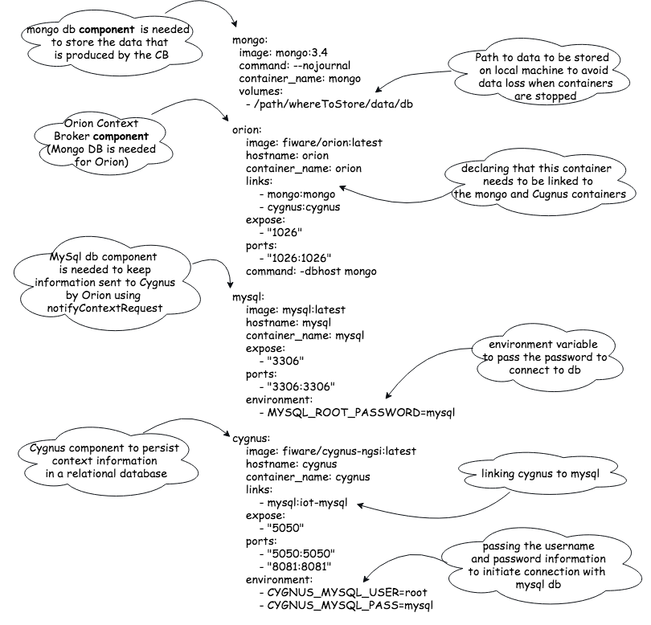
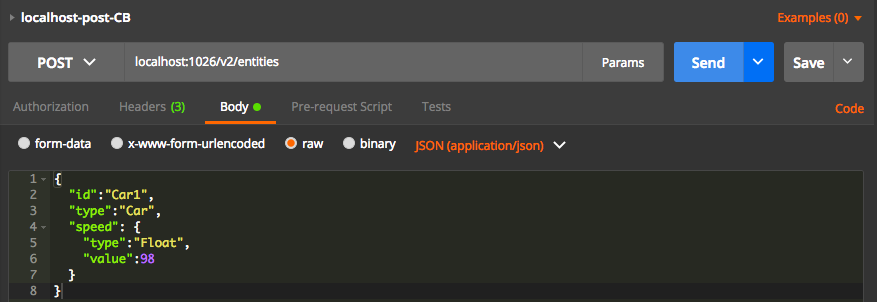
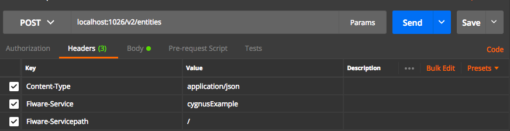
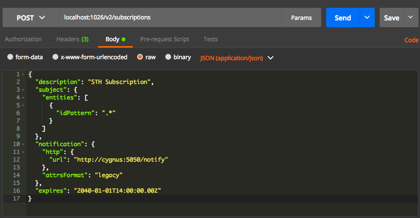
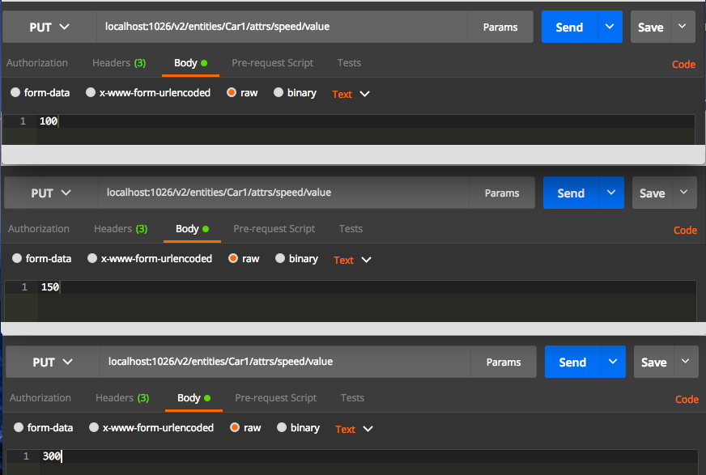
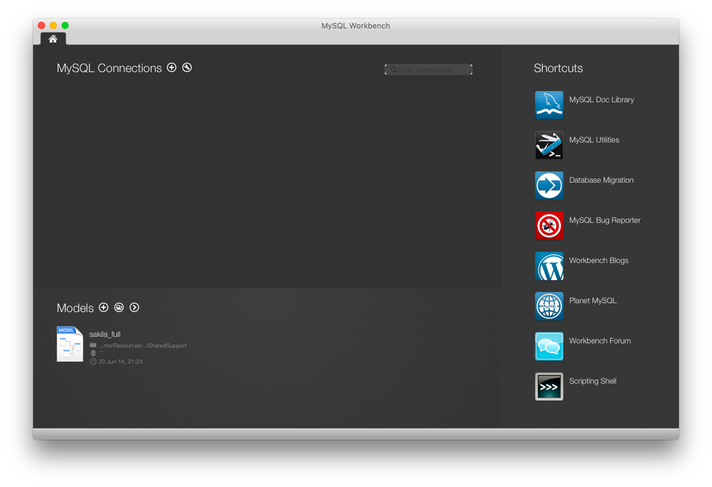
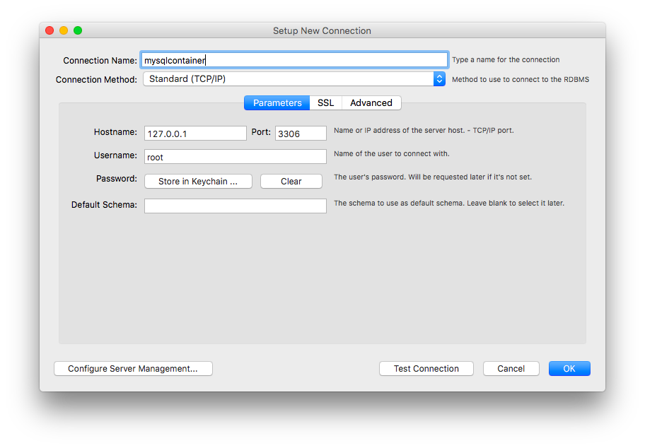
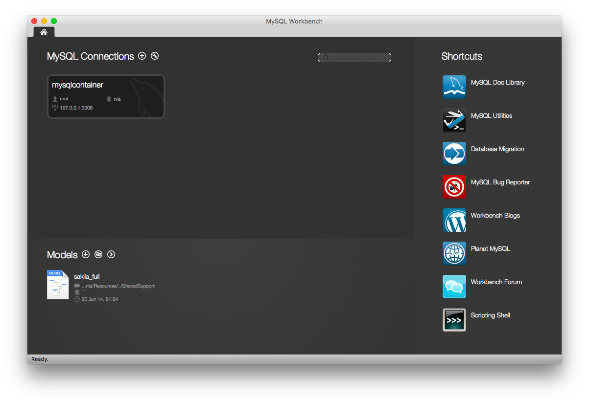
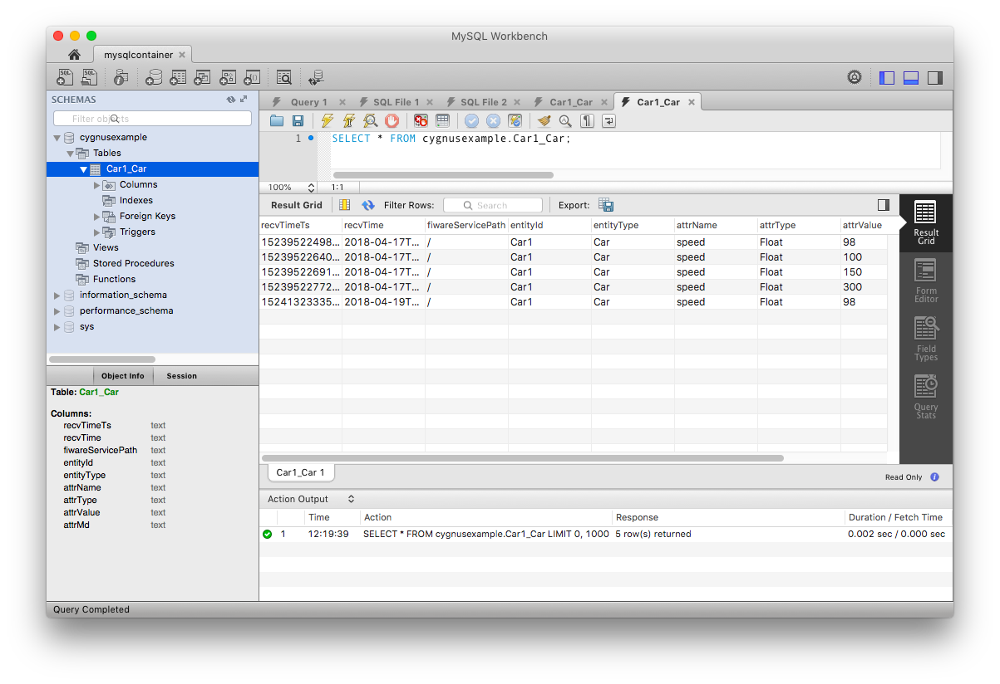

# How to store data in MySQL using Cygnus

Context information stored by the Fiware Context Broker only includes the latest value of entity attributes. In order to be able to store the historical data produced via the Context Broker ,we need to use Cygnus. Cygnus needs to be connected to a store. In this tutorial MySQL is used.

Therefore, the three main components used are:

* [Orion Context Broker](https://fiware-orion.readthedocs.io/en/master/)
* [Cygnus](http://fiware-cygnus.readthedocs.io/en/1.7.1/index.html)
* [MySQL](https://www.mysql.com/)

In the figure below we can see that the user can issue REST HTTP requests. All operations are sent to the Orion Context Broker to be processed. Cygnus subscribes to Orion Context Broker, so that Cygnus is notified of any change made to entities stored by Orion.


To walk through this tutorial you need to make sure that you have docker and docker compose running on your machine. Please, follow the installation process for docker [here](https://docs.docker.com/install/) and for docker-compose [here](https://docs.docker.com/compose/install/) based on your operating system.

After ensuring that you have docker and docker-compose running on your machine. You need to make a directory and to create a docker-compose.yml file as in the example below.



In the previous example we have various applications on various containers, all of those containers are actually linked together, so it is not needed to execute each of those containers one by one but at once with a single command. So that’s where [docker compose](https://docs.docker.com/compose/compose-file/#service-configuration-reference) comes to the picture, with docker compose we can actually run multiple applications, present in various containers, with one single command “docker-compose up”. As you can see in the example above, we are able to define four containers; one running an Orion Context Broker, one running mongoDB (it’s needed to store recent values produced by Orion), one running a MySQL and another running an Cygnus in a *.yml file, that is called “docker-compose” file.

# Running the Example

The steps that are going to be taken are the following:

* Run the docker compose (*.yml) file
* Publish Context Information to Orion Context Broker (CB)
* Create Subscription to notify Cygnus
* Update Values of an Entity
* Connect to DB and see the data collected

## Step by step

Remove all docker containers

```console
docker rm `docker ps -aq`
```

Remove all docker images

```console
docker rmi $(docker images -a -q)
```

To run Cygnus, Orion and mySQL at the same time we need to run the the docker-compose file. We need to change to the directory where we have the docker-compose.yml file and run the following command in the command line prompt

```console
docker-compose up
```

To check the images built on your local machine

```console

docker images

REPOSITORY           TAG                 IMAGE ID            CREATED             SIZE
fiware/orion         latest              5e54ba5d2f2d        2 weeks ago         266MB
mongo                3.4                 9ad59b0c0624        2 weeks ago         360MB
mysql                latest              5195076672a7        3 weeks ago         371MB
fiware/cygnus-ngsi   latest              f8dcb3f89d4a        2 months ago        509MB
```

To check the current list of running container

```console
docker ps

CONTAINER ID        IMAGE                       COMMAND                  CREATED             STATUS              PORTS                                            NAMES
7406940f3438        fiware/orion:latest         "/usr/bin/contextBro…"   11 minutes ago      Up 11 minutes       0.0.0.0:1026->1026/tcp                           orion
c30a8ba06958        fiware/cygnus-ngsi:latest   "/cygnus-entrypoint.…"   11 minutes ago      Up 11 minutes       0.0.0.0:5050->5050/tcp, 0.0.0.0:8081->8081/tcp   cygnus
187e9b6f9f49        mongo:3.4                   "docker-entrypoint.s…"   11 minutes ago      Up 11 minutes       27017/tcp                                        mongo
59ed1e7daba8        mysql:latest                "docker-entrypoint.s…"   11 minutes ago      Up 11 minutes       3306/tcp                                         mysql
```

We see that four containers are running now. Here, we can notice that the Orion Context Broker is running on port 1026. Cygnus-ngsi exposes two ports, 8081 for management purposes and 5050 for receiving notifications from Orion. For more info you can check the documentation [here](http://fiware-cygnus.readthedocs.io/en/1.7.1/cygnus-common/installation_and_administration_guide/management_interface_v1/index.html)

To make REST API Calls: There are many HTTP clients that can help you quickly test web services.

* Postman application: http://www.getpostman.com/
* Command Line using curl: https://curl.haxx.se/docs/httpscripting.html

In our example we are using Postman to perform CRUD (Create, Remove, Update, Delete) operations.
In order to check if the Orion Context Broker and the Cygnus-ngsi are really working and responsive we can test by querying the version for each and check if we get an answer.

Once we open postman we need to specify that we need to do a GET query and we need to specify the target (URI:port), in our case the queried target is as follows:

```console
$ curl --request GET --url http://localhost:1026/version

{
"orion" : {
  "version" : "1.12.0-next",
  "uptime" : "0 d, 0 h, 22 m, 56 s",
  "git_hash" : "17cec793427e5760d6ebf0fde798a9d6e4647c2c",
  "compile_time" : "Thu Mar 22 15:59:14 UTC 2018",
  "compiled_by" : "root",
  "compiled_in" : "34730c06de0c",
  "release_date" : "Thu Mar 22 15:59:14 UTC 2018",
  "doc" : "https://fiware-orion.readthedocs.org/en/master/"
}
}

```

```console
$ curl --request GET  --url http://localhost:8081/v1/version

{"success":"true","version":"1.8.0_SNAPSHOT.f189b3928aed5fb9171a1eedcd347a5c75741aa5"}
```

```console

$ docker exec -it mysql mysql -uroot -pmysql

mysql: [Warning] Using a password on the command line interface can be insecure.
Welcome to the MySQL monitor.  Commands end with ; or \g.
Your MySQL connection id is 4
Server version: 5.7.21 MySQL Community Server (GPL)

Copyright (c) 2000, 2018, Oracle and/or its affiliates. All rights reserved.

Oracle is a registered trademark of Oracle Corporation and/or its
affiliates. Other names may be trademarks of their respective
owners.

Type 'help;' or '\h' for help. Type '\c' to clear the current input statement.

mysql> SHOW DATABASES;
+--------------------+
| Database           |
+--------------------+
| information_schema |
| mysql              |
| performance_schema |
| sys                |
+--------------------+
4 rows in set (0.00 sec)

```

_Note: You can connect to DB via an IDE - this is introduced later in this tutorial_

# Operations on Entities

An entity is an object stored by the Context Broker. Each entity has one or more attributes. We can read, update or subscribe (in order to be notified once a values has been changed) to one of these attributes. The HTTP requests that we can perform on entity resources are POST, GET, PUT, DELETE.

## Create an Entity

We need to perform a POST request to the following target as follows:

> localhost:1026/v2/entities



We need to specify some header values too when sending the request:



Content-type is to specify the type of data that we want to send, always application/json.

`Fiware-Service` and `FiwareServicepath` are intended to the logical separation of the data, this is called multi-tenant model, this term refers to software architecture in which a single instance of software runs on a server and serves multiple tenants. For example; `Fiware-Service`: Tenant1. Also, a service path is a hierarchical scope assigned to an entity at creation time. For example; `Fiware-ServicePath`: /some/hierarchical/path.

_Note: these headers need to be set for all the operations we perform in this example_

## Subscribe Cygnus to Orion

Context Consumers can subscribe to receive context information that satisfy certain conditions using the subscribe operation. Such subscriptions may have an expiration time. In return, the Context Broker notifies updates on context information to subscribed Context Consumers by invoking the notify operation they export as an HTTP endpoint capable of processing POST requests.

The entities and notifications subfields define the contents of the notification messages.

* `idPattern` is used to filter which entities we want. Its value is a regular expression. In our example we set it to retrieve all.
* The `URL` where to send notifications is defined with the  “url” sub-field. Here we specified the url of the Cygnus-ngsi.
* `attrsFormat`: we set it to legacy because the Cygnus only understands NGSI v1 notification payloads.
* Subscriptions may have an expiration date expires field, specified using the ISO 8601 standard format. Once subscription overpass that date, the subscription is simply ignored.

> localhost:1026/v2/subscriptions



After creating a subscription we need to update the attribute values the same way we did before to be able to store data persistently in the DB. In the figure above we can see that notifications are sent to http://cygnus:5050/notify

To see changes of values in the DB we need to update the attribute value for some entity at different points in time. The following example shows how we can change an attribute value several times by performing PUT request to the following URL

> localhost:1026/v2/entities/Car1/attrs/speed/value



Now if we check the databases contained in MySQL we can see the name of the tenant we were performing the the operations on. In our example we used “cygnusexample” as tenant name. 
After subscribing to Cygnus and updating values several times, you can check the content of the DB  the command prompt or via an IDE

## Check DB via command prompt

After connecting the container as described earlier in this tutorial

```console
$ mysql> SHOW DATABASES;

+--------------------+
| Database           |
+--------------------+
| information_schema |
| cygnusexample      |
| mysql              |
| performance_schema |
| sys                |
+--------------------+
5 rows in set (0.00 sec)

```

## Connect to MySql via MySql workbench IDE

You can install MySQL workbench from [here](https://dev.mysql.com/downloads/workbench/).
After installing the IDE and running it you will see the following window



At the top left corner next to MySQL Connection, you can press the + button to create a new connection the DB. you will see the following window 




In the Setup New Connection window we need to add the hostname and the port of the running server of MySQL. In our case it’s the address information of the container running MySQL. Username and password are the same variables we set in the Docker compose file (in our case it’s root/mysql). Once you are done you can test the connection and press ok. A box with the same connection name will appear as follows



You can press on the box in the left pane containing the DB connection you created, and the following window will appear



In the left pane we can see all databases as well as the database created through Cygnus (“cygnusexample” in our case). We can see also that there is a table with the same name of the entity we created via Orion. If we select all table records we can see all the values we have changed at different time slots.

## Terminating the Running Container


```console
$ docker-compose down

Stopping orion  ... done
Stopping cygnus ... done
Stopping mongo  ... done
Stopping mysql  ... done
Removing orion  ... done
Removing cygnus ... done
Removing mongo  ... done
Removing mysql  ... done

```