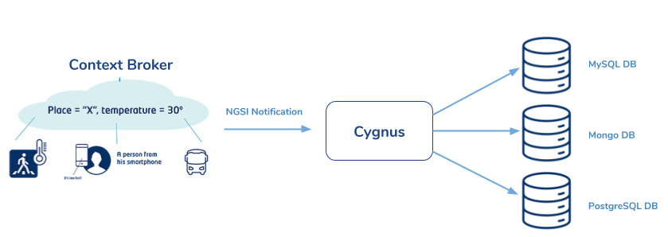
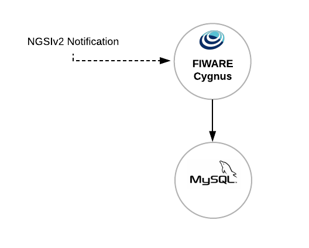
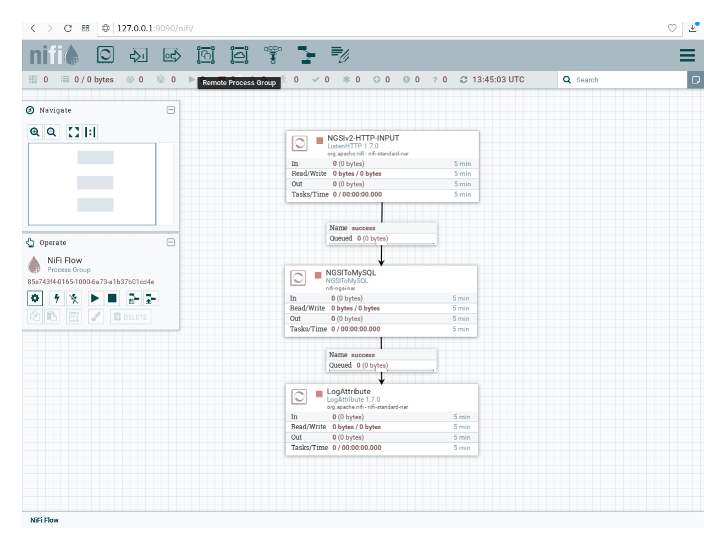

Context information stored by the Fiware Context Broker only includes the latest
value of entity attributes. In order to be able to store the historical data
produced via the Context Broker ,we need to use Cygnus. Cygnus needs to be
connected to a store.

Cygnus is a is an easy to use, powerful, and reliable system to process and
distribute data. Internally, Cygnus is based on Apache NiFi, NiFi is a dataflow
system based on the concepts of flow-based programming. It supports powerful and
scalable directed graphs of data routing, transformation, and system mediation
logic. It was built to automate the flow of data between systems. While the term
'dataflow' is used in a variety of contexts, we use it here to mean the
automated and managed flow of information between systems.

In the figure below we can see that the user can issue REST HTTP requests. All
operations are sent to the Orion Context Broker to be processed. Cygnus
subscribes to Orion Context Broker, so Cygnus is notified of any change made to
entities stored by Orion and then this data is persisted in one or more
databases.



In Cygnus, you can define where you want to store your data and then, the
database and tables will be created with a specific structure defined by the
NGSI format. For example, if you want to use the MySQL and Cygnus, you will have
a scenario like is showed in the next figure:



When you start Cygnus, add and configure your processors, you will be able to
persist your data into your database.



For this case, if Cygnus receive a notification with this format:

```bash
URL=$1

curl $URL -v -s -S --header 'Content-Type: application/json; charset=utf-8' --header 'Accept: application/json' --header "Fiware-Service: qsg" --header "Fiware-ServicePath: test" -d @- <<EOF
{
	"subscriptionId": "51c0ac9ed714fb3b37d7d5a8",
	"data": [{
		"temperature": {
			"type": "Float",
			"value": 30.73,
			"metadata": {}
		},
		"type": "Room",
		"id": "Room1"
	}]
}
EOF
```

The data will be stored in the MySQL database with the name "qsg"
(Fiware-Service value) in the table "test"(Fiware-Service-Path value) and the
structure of the table defined by the entities and attributes (for information
about the structures please go to the
[Cygnus Documentation](https://fiware-cygnus-ld.readthedocs.io/en/latest/)):

output:

```
+--------------------+
| Database           |
+--------------------+
| information_schema |
| mysql              |
| performance_schema |
| qsg                |
| sys                |
+--------------------+
5 rows in set (0.06 sec)
```

```
mysql> use qsg;
mysql> show tables;
```

output:

```
+---------------+
| Tables_in_qsg |
+---------------+
| test          |
+---------------+
1 row in set (0.09 sec)
```

```
mysql> select * from test;
```

output:

```
+---------------+---------------------+-------------------+----------+------------+-------------+----------+-----------+--------+
| recvTimeTs    | recvTime            | fiwareServicePath | entityId | entityType | attrName    | attrType | attrValue | attrMd |
+---------------+---------------------+-------------------+----------+------------+-------------+----------+-----------+--------+
| 1535550393717 | 08/29/2018 13:46:33 | test              | Room1    | Room       | temperature | Float    | 30.73     | []     |
+---------------+---------------------+-------------------+----------+------------+-------------+----------+-----------+--------+
1 row in set (0.05 sec)
```

Thus, using Cygnus Generic enabler you can store all the data coming from the
Orion context Broker and the databases and tables will be created automatically.
