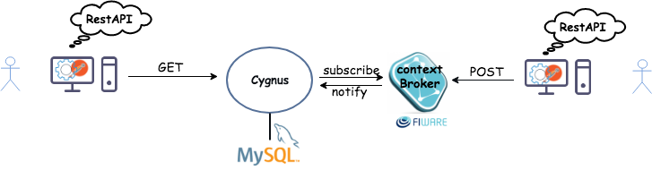

<hr class="core" style="display:none"/>
<h2>How to store data in MySQL using Cygnus</h2>

Context information stored by the Fiware Context Broker only includes the latest
value of entity attributes. Cygnus is one option to be able to store the
historical data produced via the Context Broker. Cygnus itself needs to be
connected to a store. In this example MySQL is used.

Therefore, the three main components used are:

-   [Orion Context Broker](https://fiware-orion.readthedocs.io/en/master/)
-   [Cygnus](http://fiware-cygnus.readthedocs.io/en/1.7.1/index.html)
-   [MySQL](https://www.mysql.com/)

In the figure below we can see that the user can issue REST HTTP requests. All
operations are sent to the Orion Context Broker to be processed. Cygnus
subscribes to Orion Context Broker, so that Cygnus is notified of any change
made to entities stored by Orion.



In a typical configuration, the Orion Context Broker will be running on
port 1026. Cygnus exposes two ports, 5081 for management purposes and 5050 for
receiving notifications from Orion. For more info you can check the Cygnus
Management Interface
[documentation](https://fiware-cygnus.readthedocs.io/en/latest/cygnus-common/installation_and_administration_guide/management_interface_v1/)

## Configure Cygnus

The settings for each sink can be configured within the relevant `*.conf` file,
or alternatively via Docker `ENV` variables and secrets. Some typical values for
MySQL can be seen below:

```apacheconf
# ============================================
# NGSIMySQLSink configuration
# ============================================
cygnus-ngsi.sinks.mysql-sink.channel = mysql-channel
cygnus-ngsi.sinks.mysql-sink.type = com.telefonica.iot.cygnus.sinks.NGSIMySQLSink

# Connection to the MySQL Server
# the FQDN/IP address where the MySQL server runs
# the port where the MySQL server listens for incomming connections
# the username and password (can also be set as Docker secrets)
cygnus-ngsi.sinks.mysql-sink.mysql_host = mysql
cygnus-ngsi.sinks.mysql-sink.mysql_port = 3306
cygnus-ngsi.sinks.mysql-sink.mysql_username = root
cygnus-ngsi.sinks.mysql-sink.mysql_password = xxxxxxxxxxxx

# Other options available for MySQL
cygnus-ngsi.sinks.mysql-sink.enable_encoding = false
cygnus-ngsi.sinks.mysql-sink.enable_name_mappings = false
cygnus-ngsi.sinks.mysql-sink.enable_grouping = false
cygnus-ngsi.sinks.mysql-sink.enable_lowercase = false
cygnus-ngsi.sinks.mysql-sink.attr_persistence = row
cygnus-ngsi.sinks.mysql-sink.data_model = dm-by-entity
cygnus-ngsi.sinks.mysql-sink.batch_size = 100
cygnus-ngsi.sinks.mysql-sink.batch_timeout = 30
```

## Subscribe Cygnus to Orion

Context Consumers can subscribe to receive context information that satisfy
certain conditions using the subscribe operation. Such subscriptions may have an
expiration time. In return, the Context Broker notifies updates on context
information to subscribed Context Consumers by invoking the notify operation
they export as an HTTP endpoint capable of processing POST requests.

The entities and notifications subfields define the contents of the notification
messages.

-   The `fiware-service` and `fiware-servicepath` headers are used to filter the
    subscription to only listen to measurements from the attached IoT Sensors,
    since they had been provisioned using these settings
-   The `idPattern` in the request body ensures that Cygnus will be informed of
    all context data changes.
-   The notification `url` must match the configured `CYGNUS_API_PORT`
-   The `attrsFormat=legacy` is required since Cygnus currently only accepts
    notifications in the older NGSI v1 format.
-   The `throttling` value defines the rate that changes are sampled.

Subscriptions may have an expiration date expires field, specified using the ISO
8601 standard format. Once subscription overpass that date, the subscription is
simply ignored.

Once a dynamic context system is up and running, we need to inform **Cygnus** of
changes in context.

This is done by making a POST request to the `/v2/subscription` endpoint of the
Orion Context Broker.

```bash
curl -iX POST \
  'http://localhost:1026/v2/subscriptions' \
  -H 'Content-Type: application/json' \
  -H 'fiware-service: cygnusexample' \
  -H 'fiware-servicepath: /some/service-path' \
  -d '{
  "description": "Notify Cygnus of all context changes",
  "subject": {
    "entities": [
      {
        "idPattern": ".*"
      }
    ]
  },
  "notification": {
    "http": {
      "url": "http://cygnus:5050/notify"
    },
    "attrsFormat": "legacy"
  },
  "throttling": 5
}'
```

After creating a subscription Cygnus need to update the attribute values the
some context data to store data persistently in the DB. In the figure above we
can see that notifications will be sent to `http://cygnus:5050/notify`

This request updates the value of an existing sensor

```bash
curl -iX PATCH \
  --url 'http://orion:1026/v2/entities/urn:ngsi-ld:Sensor:001/attrs' \
  --header 'Content-Type: application/json' \
  --header 'Fiware-Service':      'cygnusexample' \
  --header 'Fiware-ServicePath':  '/some/service-path' \
  --data ' {
      "temperature":{"type":"Integer", "value": 89}
}'
```

## Check DB via command prompt

After connecting to the MySQL server, a new `cygnusexample` database has been
created which holds the changing values of the subscribed context entities:

```sql
$ mysql> SHOW DATABASES;

+--------------------+
| Database           |
+--------------------+
| information_schema |
| cygnusexample      |
| mysql              |
| performance_schema |
| sys                |
+--------------------+
5 rows in set (0.00 sec)
```
