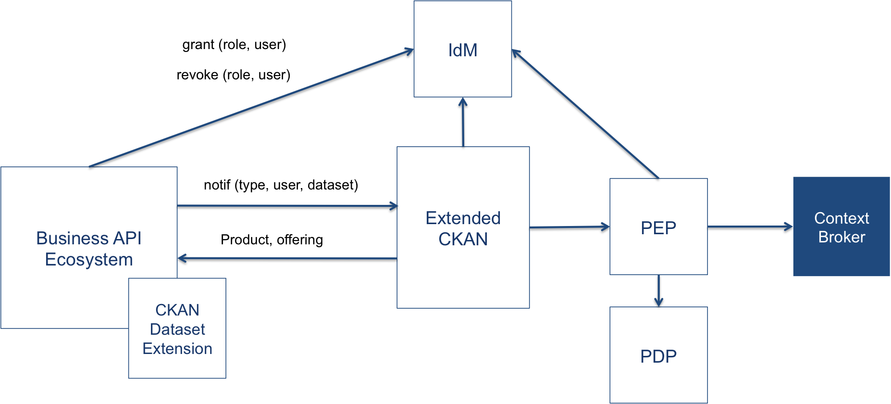

# CKAN Monetization Architecture

In the context of the FIWARE platform, CKAN is used as the catalog where data
can be published, discovered, managed, and consumed. Within the FIWARE platform,
not only static datasets (CSV, XLSX, etc) are supported, but also real (right)
time context information can be published in CKAN as Context Broker queries (for
instance, pollutants level in Madrid, etc.)

In addition, using the Biz Ecosystem GE, FIWARE provides the components that
allow to manage the access and monetisation of published datasets.

The following picture shows the architecture followed in FIWARE for the
publication and monetization of data.

As can be seen in the previous image, the following components are integrated in
order to manage and monetize data:

-   Extended CKAN: Used for the publication of the static datasets and the
    Context Broker queries.
-   Biz Ecosystem: Used for the creation and acquisition of data offerings,
    including customer charging, and access grant
-   IdM + PEP + PDP (Security Framework): Used for the provision of identities,
    authentication, and authorization of users.

It is needed to remark that the context information published in CKAN is served
by a Context Broker deployed in the backend. Thus, for those scenarios where the
dataset is not completely open, or it is wanted to be monetized, the context
broker instance must be secured using the security framework as described in
[Handling Authorization and Access Control to APIs](../security/introduction.md)

For the monetization of the published datasets, the Biz framework is the
component in charge of granting and revoking access to the acquired datasets.
This task is done by sending notifications that depend on the kind of dataset
being acquired. In particular:

-   For static datasets: The Biz Ecosystem uses the API exposed by the private
    datasets CKAN extension (described later) in order to include the user in
    the access list of the particular dataset.
-   For Context Broker queries: The Biz Ecosystem also grants access to the
    context broker service by giving a particular role (defined by the provider)
    to the customer user. This role has a bound policy that specifies the
    permissions to access to the acquired query.

To support the aforementioned functionality, it has been needed to extend CKAN
with features as NGSI support, OAUth2, or datasets privacy restrictions. In the
following sections it is described the different extensions that have been
developed within FIWARE, and that made up the FIWARE Extended CKAN.

## OAuth2

The CKAN OAuth2 extension allows site visitors to login using an OAuth2 server.
In this way, the FIWARE IdM can be used as the identity provider leveraging the
single sign-on approach required for the monetization and access control
management of CKAN datasets.

This extension is available in
[GitHub](https://github.com/conwetlab/ckanext-oauth2)

## Private Datasets

This CKAN extension allows users to control the visibility of their datasets,
enabling the creation of private datasets that only certain users are able to
access. This extension is core in order to support the access control and
monetization of datasets since provides the CKAN access list of the particular
dataset.

This extension provides an HTTP API that allows to add and remove users from the
dataset access list, enabling the Biz Ecosystem to automatically manage these
permissions.

This extension is available in
[GitHub](https://github.com/conwetlab/ckanext-privatedatasets)

## NGSI View

This CKAN extension provides the ability to generate real time (or right time)
resources provided by a Context broker, offering the means for registering a
query as a dataset resource.

This extension defines the NGSI format and provides a basic view for visualizing
the result of the published Context Broker query.

This extension is available in
[GitHub](https://github.com/telefonicaid/ckanext-ngsiview)

## Store publisher

This CKAN extension allows users to publish datasets in the FIWARE Store
(Business API Ecosystem GE) as offerings in a simpler way. To do so, a new tab
is added in the Datasets Manage menu, which offers a form to set the basic
options of the offering.

This extension is available in
[GitHub](https://github.com/FIWARE-TMForum/ckanext-storepublisher)

## WireCloud view

CKAN view extension for the creation and display of rich embedded dashboards
intended for the visualization of datasets using WireCloud (Application Mashup
GEri). With this extension it is possible to create a view for a resource, both
by loading pre-existing dashboards or by the creation of new dashboards by means
of a set of wizards.

This extension is available in
[GitHub](https://github.com/conwetlab/ckanext-wirecloud_view)

## Data requests

This CKAN extension allows users to ask for datasets that are not already
published in the CKAN instance. In this way, it is possible to set up a Data
Market, not only with data supplies but also with data demands.

This extension is available in
[GitHub](https://github.com/conwetlab/ckanext-datarequests)
