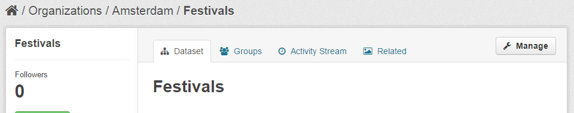

<h2>Offering Datasets via the CKAN Interface</h2>

The FIWARE CKAN version has been extended with a set of plugins intended to
provide a high integration with other FIWARE components. In particular, the
Store Publisher plugin allows FIWARE users to offer their published datasets in
the FIWARE Store, by enabling the creation of offerings directly from the CKAN
interface. In this way, users do not need to go to a different system saving
time and improving the usability.

<!-- textlint-disable write-good -->

In order to create an offering using the CKAN interface, you must be logged in,
so you can manage your published datasets. Once you have entered in CKAN, open
the dataset you want to offer and click on the “Manage” button.

<!-- textlint-enable write-good -->

The displayed view, allows you to perform some management tasks like updating
the dataset info, updating the provided data, or removing the dataset. To
publish your dataset in the FIWARE Store select the “Publish” tab.

In this tab, you have to provide some information of the offering:

-   Name: Name you want to give to your offering in the FIWARE Store
-   Description (optional): Textual description of your offering that will be
    displayed to FIWARE Store users
-   Categories (optional): Set of categories of your offering. The available
    categories are retrieved from the FIWARE Store so you can choose among them
-   Catalog: Catalog where you want to publish your offering. The list of
    catalogs where you have publish rights is retrieved from the FIWARE Store
-   Version: Version of your offering
-   License (optional): License of the data being published
-   License Description (optional): Description of the license of the data
-   Image (optional): Image to be displayed in the FIWARE Store attached to your
    offering. If you do not include any, the CKAN logo will be used
-   Price (optional): Price of the offering. If you do not include this field,
    the offering is considered free

Note that you can use the “License” and “License Description” fields in order to
include the terms and conditions for using the data. In this regard, if you
include those fields, customers will need to explicitly accept them to be able
to acquire the offering.

<!-- textlint-disable write-good -->

You may have noticed that this way of creating offerings has some restrictions.
On the one hand, the offering is created just with the dataset, so you cannot
create composite offerings with multiple data sources or visualization tools. On
the other hand, the displayed form only allows you to create one time payments,
so you cannot create recurring payments or usage based payments. If your model
require any of these features you can offer your datasets using the FIWARE Store
interface as explained in
[here](/publishing-open-data-in-fiware/how-to-offer-datasets-including-context-information-through-the-wstore/offering-datasets-through-the-wstore-interface/)

<!-- textlint-enable write-good -->
