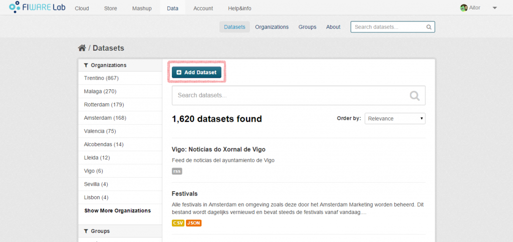
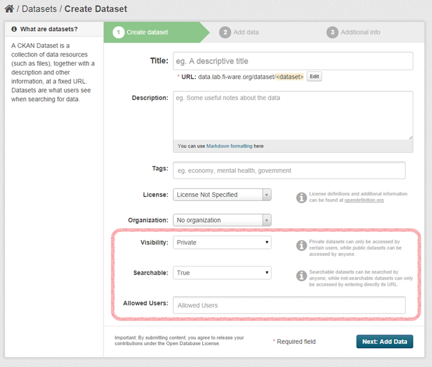
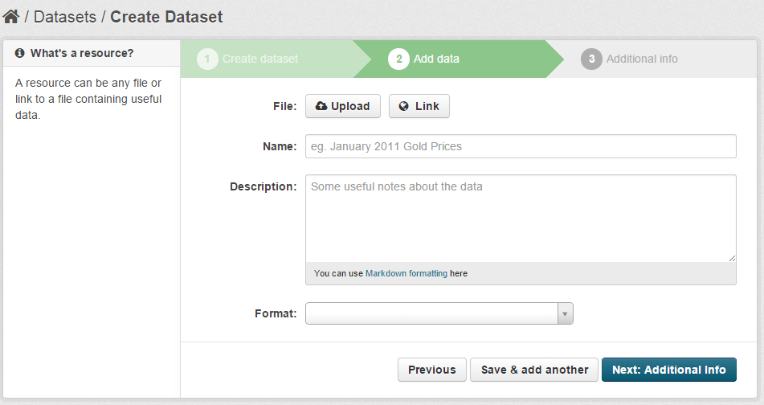
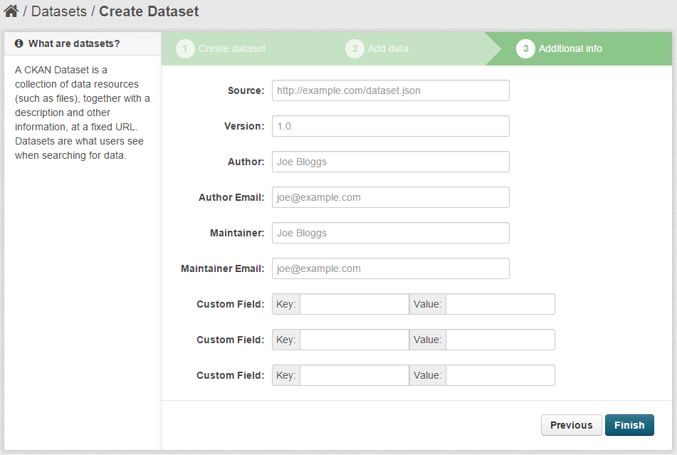

CKAN allows you to publish your own datasets in order to make them accessible to
other users of the platform. In particular, you can upload your datasets as
files directly into CKAN, or you can provide a link to the data. This section
explains the process that have to be carried out in order to publish a dataset
in CKAN.

To publish your own datasets (open data) in CKAN, you have to access the
[FIWARE Data portal](https://data.lab.fiware.org/) and sign in with a valid
FIWARE Account (see the section
[Create your identity in FIWARE](/security/how-to-create-your-identity-in-fiware.md).

Once you have signed in, go to the “Datasets” section and click on the “Add
Dataset” button.

In the first step, you have to provide some basic information such as the name,
the description or the tags of your dataset. In addition, you also have to
include some additional information intended to specify the visibility of the
dataset:

-   Visibility: if you choose “Public”, all the users (even those that are not
    logged in) will be able to access the dataset. Otherwise, only some selected
    users will be able to access the dataset.
-   Searchable: you can choose if you want your dataset to be displayed in the
    queries performed by the FIWARE Data portal users.
    -   This field is only enabled when “Visibility” is set to “Private”.
    -   If you create a public dataset, it will be always searchable.
-   Allowed Users: the list of users that can access your dataset.
    -   This field is only enabled when “Visibility” is set to “Private”.

In the second step you have to provide the data itself. To do that, you can
provide a link or upload a file with the data. Any type of file is allowed, but
if you want to generate an automatic API to access your data, you must upload a
CSV file.

> **NOTE**: Take into account that “Private” resources created using the link
> option must be secured using the appropriate mechanism (e.g. by following the
> [Handling authorization and access control to APIs][] tutorial). CKAN will
> only control the access using the CKAN interface, but direct access to the
> linked resource must be controlled on the resource itself.

You can also provide dynamic context information by providing a context broker
URL and selecting the `fiware-ngsi` format. Once selected the `fiware-ngsi`
format, three extra fields will appear allowing you to configure the tenant and
the service path to use for accesing the context broker (you can leave them
empty if the data is stored in the default tenant or service path). The last
field allows you to indicate whether the context broker requires authentication
(see the [Handling authorization and access control to APIs][] tutorial for more
details).

> **NOTE**: `fiware-ngsi` resources are always linked resources, so if the
> dataset is private, the `fiware-ngsi` must require an auth token for
> coherence.

In the last step you can provide some metadata (Author, version, maintainer,
etc). Nevertheless, this metadata is not a must, so you can skip this section if
you want.

[handling authorization and access control to apis](/security/introduction.md)
