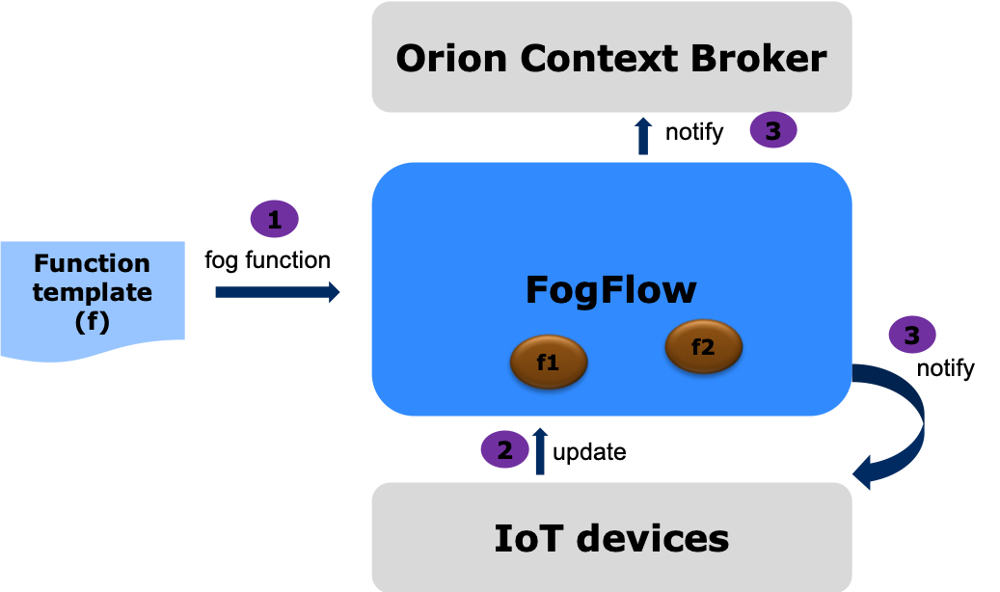

In the FIWARE IoT architecture, FogFlow is the cloud-edge computing framework to efficiently orchestrate dynamic data processing over clouds (e.g., public clouds or your private clouds) and edges (e.g., raspberry Pi devices, IoT Gateways, or nearby small data centers) for data-intensive IoT Services. Those IoT services are deployed seamlessly across the cloud and edges, running dynamic data processing pipelines to link context producers (e.g., small IoT devices like temperature/humidity sensors or connected cameras) and result consumers (e.g., alarms or external apps that subscribe to the results generated by FogFlow) together. For example, As various endpoint devices join and leave, their associated data processing tasks will be automatically launched on the fly according to their availability and also those tasks will be allocated to the edge nodes that are close to the producers and consumers. 

Assume that a FogFlow system has been set up [Setup FogFlow](https://fogflow.readthedocs.io/en/latest/setup.html), the main feature of FogFlow can be tested and validated by IoT service developers with the following three steps, as illustrated by the following figures. 

1) Service developers define and submit fog functions with the provided function template

With the fog function editor at the FogFlow Dashboard, a fog function can be defined and summited in a few minutes. 
Please check the detailed instructions below. 

-   [specify a fog function](https://fogflow.readthedocs.io/en/latest/example1.html)

2) Context producers start to publish raw data, which will trigger the defined fog function to generate some analytics result. 

Assume that the context producer is a connected IoT device which can run some nodejs/python based program, you can follow the instructions below.     

-   [connect an IoT device](https://fogflow.readthedocs.io/en/latest/example4.html)

3) The generated results are consumed by consumers, which can be an actuator device or some external NGSI application

In order to recevie the generated results, the consumers need to issue a subscription. Assume that the result consumer is a running Orion Context Broker, you can find the detailed instructions below. 

-   [Integrate with Orion](https://fogflow.readthedocs.io/en/latest/example3.html#orion-broker-as-the-destination)

