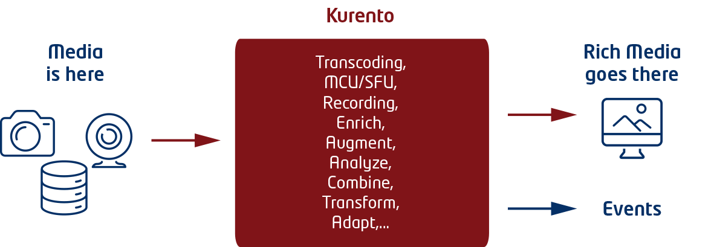

Your application may also need to integrate multimedia information. Multimedia
information comprises audio and video data, which is commonly used for the
exchange of complex information among humans (i.e. video conferencing,
video-clip sharing, multimedia instant messaging, etc.) In addition to this, in
the last few years, cameras and microphones are often used as advanced sensors
that, combined with computer vision and other analysis techniques, may generate
rich information useful in different application areas including eHealth, smart
cities, security and defence, entertainment, etc.

Incorporating into your application such features may be done using the
Real-time Multimedia Stream processing GE (reference implementation Kurento). In
particular, you may be interested in the following usage patterns.

**Multimedia communications. **

You application may take advantage of this pattern whenever the introduction of
human-to-human communications on it makes sense. That communication may take
place following different information topologies such as person-to-person (i.e.
traditional call model), person-to-people (i.e. from one sender to several
receivers), people-to-people (i.e. group model where all participants can send
and receive the information). The communication can be complemented with other
features provided by the enabler such as media recording (i.e. storing in a
persistent way the media stream of one or several people) and media playing
(i.e. integrating into the communication clips previously recorded).

**Multimedia sensor basing on computer vision.**

This pattern is based on using computer vision or speech analysis techniques to
transform a device camera into an advanced sensor. Kurento provides,
off-the-shelf, some basic computer vision capabilities for detecting faces,
detecting crowds, detecting car plates, detecting movement, etc. However, you
can create your own analysis modules and plug them into Kurento in a simple and
seamless way. Note that most of these analyses lead to generation of data that
takes the form of events (e.g. detected a specific face, detected a car plate,
detected an intruder, etc.) You may want to manage these events as Context
Information.  You can do this by means of updates on context information using
operations exported by the Context Broker GE.

**Multimedia enrichment basing on augmented reality. **

This pattern is useful when combined with multimedia communications to generate
applications where the capabilities of the people receiving multimedia
information are augmented by the system. Augmented reality basically consists on
adding layers of information on top of the basic media stream captured by the
camera. This makes possible for the receiver to see information that is beyond
the reality being communicated. This may be useful in different scenarios
including, for example, entertainment scenarios (e.g. adding costumes to people
in a conference), in learning scenarios (e.g. augmenting the teaching lessons
with animations or texts), in health (e.g. augmenting the communication with a
patient with biometric data), in security (e.g. augmenting information on the
identity of the people captured by a camera), in industrial applications (e.g.
adding instructions on how to manage or repair a complex machine), in
advertising (e.g. adding customized ads to the media stream depending on context
or on other available data), etc.

If you are interested in learning more about the Real-time Multimedia Stream
Processing GE and its reference implementation, Kurento, you may find useful the
following information:

-   [What’s WebRTC and what’s a media server](/processing/kurento/whats-webrtc-and-whats-a-media-server.md)
-   [What’s the architecture of a Kurento enabled application](/processing/kurento/whats-the-architecture-of-a-kurento-enabled-application.md)
-   [How to develop a Kurento enabled application](/processing/kurento/how-to-develop-a-kurento-enabled-application.md)

If you want to start experimenting and doing hands-on work, have a look at:

-   [Kurento GEri](https://github.com/Kurento/kurento-media-server)
