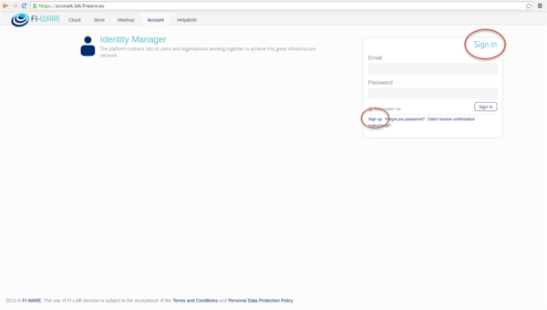

The first step to start using identity components in FIWARE is to create
an account under “Account”. In order to do that you have to access the
Account Portal and click in “Sign Up” option:

Then follow the instructions filling your data and waiting for the
confirmation mail.

Once you have an account you can start creating organizations and
applications.
