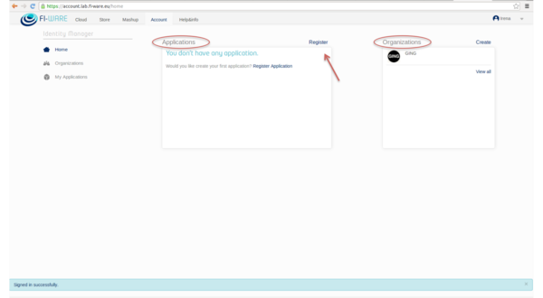
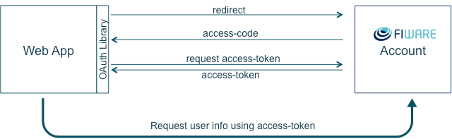
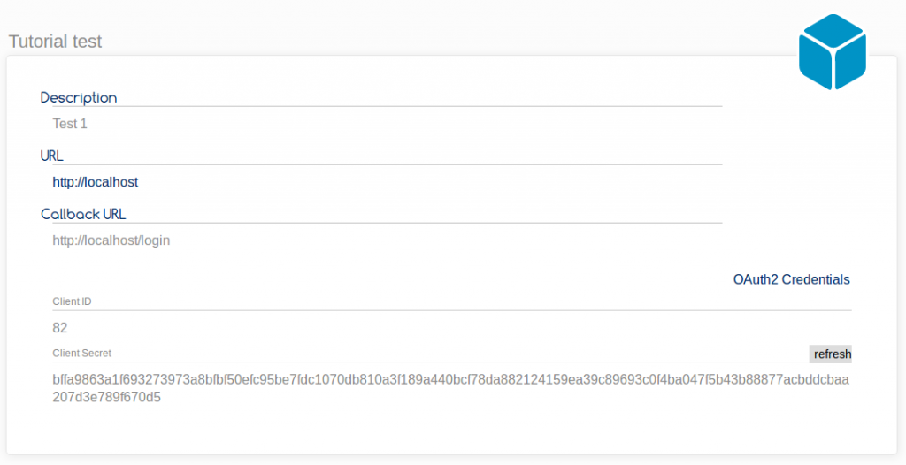

The first step to start managing authorization in your application is to
register the application in FIWARE Account. In order to do that you have to
click on “Register” option of the Account Portal

  
Then follow the steps with the data of your application. Once registered, you
have to implement OAuth2 protocol in your application. The message flow between
your web application and IDM account server should be:

In order to implement this flow you can use an OAuth2 library.
[Here](http://oauth.net/2/) you will find implementations for PHP, Cocoa, iOS,
Java, Ruby, Javascript, Python … We have developed a Node.js
[example](https://github.com/ging/fi-ware-pep-proxy) that you can download and
test following these instructions:

1. Software requirements:  
   nodejs  
   npm

2. Install the dependencies:  
   npm install

3. Configure OAuth2 credentials (ClientID and Client Secret) in config.js file.
   You will find them in your IDM account:

