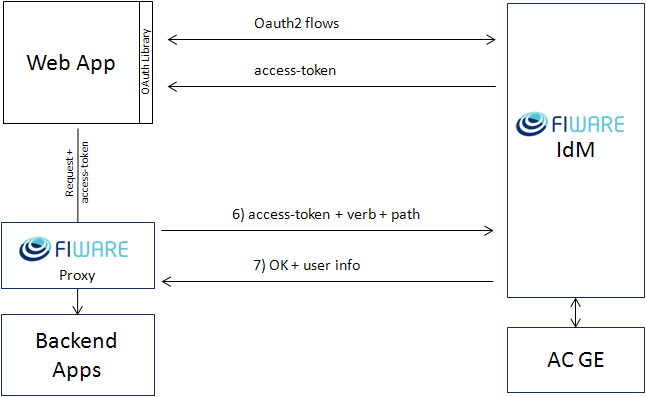

You can define custom roles for your applications via the IdM interface,
then permissions for each role.

  
When you define new role permissions, the IdM commits the resulting
access control policy to the FIWARE Access Control GE. From now on, for
every access request, the FIWARE Proxy protecting your application
requests an authorization decision (XACML) to the IdM GE which forwards
it with extra user info to the Access Control GE. The Access Control GE
replies with Permit or Deny Decision (XACML) to the IdM GE which in turn
forwards the decision to the Proxy. The Proxy blocks the application
request if and only if the decision is Deny.

