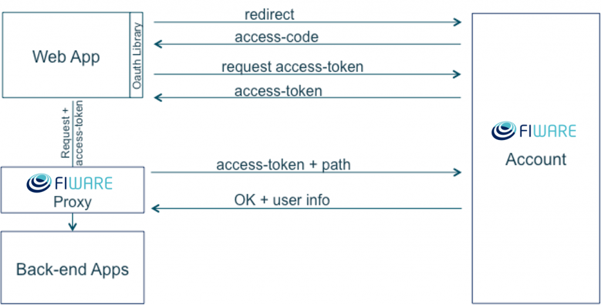

<hr class="security" style="display:none"/>
<h2>How to secure your backend service</h2>

You can also develop backend applications using FIWARE Account authentication.
To do so you should use our FIWARE PEP Proxy that allows you to validate the
requests before sending them to your server:

[](images/HowToImplementOAuth2InYourApplication7.png)

You can download the proxy [here](https://github.com/ging/fiware-pep-proxy). The
instructions to install and use it are:

Installation:

**1.** Software requirements: Node.js npm

Note: Both can be installed from (http://nodejs.org/download/)

**2**. Clone Proxy repository:

```bash
git clone https://github.com/ging/fi­ware-pep‐proxy.git
```

**3.** Install the dependencies:

```bash
cd fiware‐pep‐proxy/
npm install
```

**4.** Configure the app host in config.js file.

```javascript
//Hostname to forward authenticated requests
config.app_host = "www.google.es";
//Port where the HTTP server is running
config.app_port = "80";
```

**5.** Start the proxy server

```bash
sudo node server
```

**How to use**

Requests to the proxy should be made with a special HTTP Header like in the
previous example: X­‐Auth­‐Token. This header contains the OAuth access token
obtained from FIWARE IDM GE.

```
GET / HTTP/1.1
 Host: proxy_host
 X-­Auth-­Token:z2zXk...ANOXvZrmvxvSg
```

To test the proxy you can generate this request running the following command:

```bash
curl -­‐header "X-­Auth­‐Token:z2zXk...ANOXvZrmvxvSg" http://proxy\_host
```

Once authenticated, the forwarded request will include additional HTTP headers
with user info:

```
X-­Nick-­Name: nickname of user in IDM
X-­Display­‐Name: display name in IDM
```

In the FIWARE eLearning platform you will find a
[webinar](http://edu.fiware.org/course/view.php?id=79) and a detailed
[tutorial](http://edu.fiware.org/course/view.php?id=63) explaining you how to
create accounts, applications and manage authorization in your applications.
