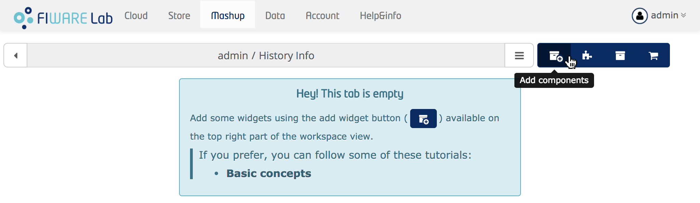
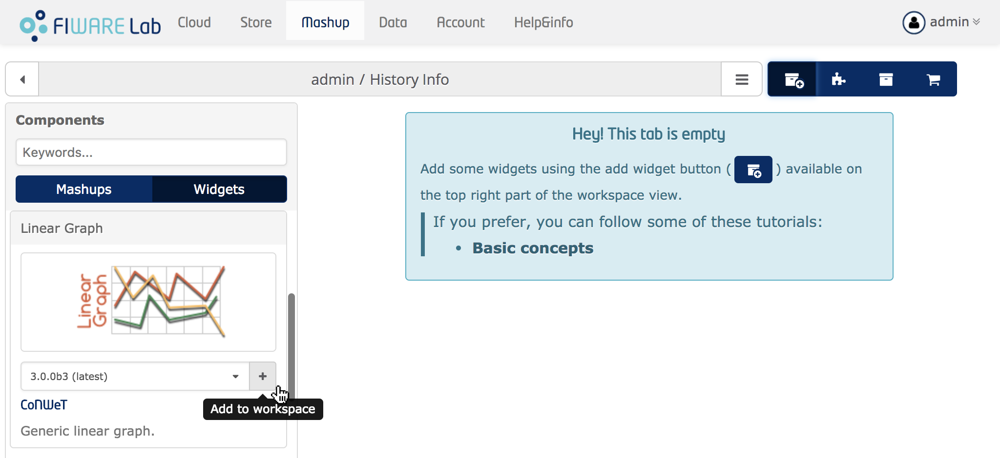
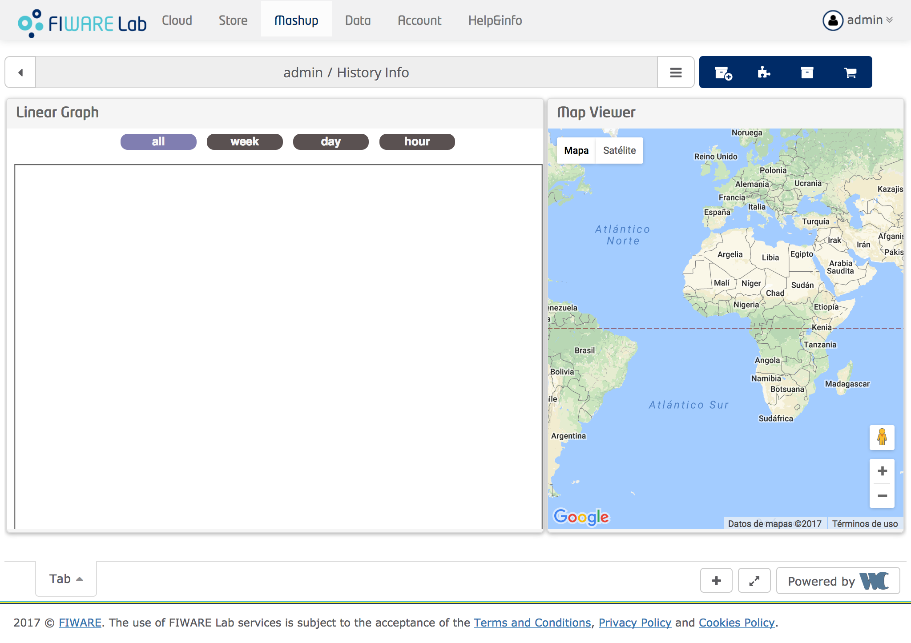

<h2>How to create your application dashboard</h2>

Once obtained the initial set of components, you can start creating your
dashboard by adding some of the widgets into your workspace area:

You do not need to add those widgets in a particular order as you can always
move and resize them as you want. You can also minimize, remove, rename, and
configure, etc. those widgets.
