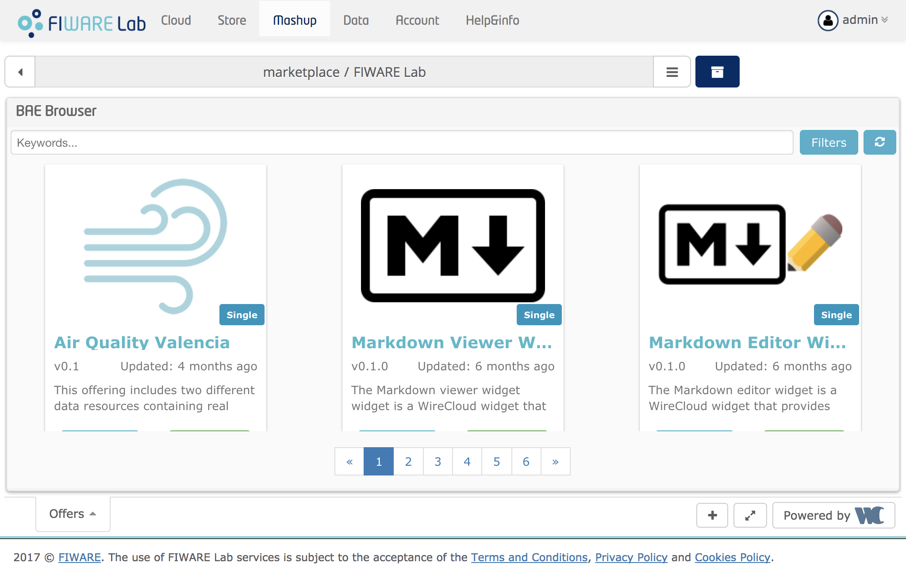

<h2>How to find widgets and other components</h2>

The first step to create an application dashboard using WireCloud is the
discovering of the components you are going to use. You can obtain those
component in several ways, but one of the easiest way is accessing the WireCloud
catalogue. This catalog is seamlessly integrated with the FIWARE Marketplace.
This marketplace is in turn made up of stores, where they can offer and deal
with Application Mashup Components (MACs), namely widgets and operators, but
also other existing mashups, they can combine to create value added application
dashboards connected to backend services and datasets. On the marketplace, you
can quickly search, find and compare widgets, operators, and even pre-built
mashups.

The following figure illustrates how the FIWARE Store portal is viewed from
WireCloud:

The WireCloud community has already made available an ever-growing catalogue of
widgets, operators and pre-built mashups that help you to create your
application dashboards. Some of them take advantage of other GEris like Kurento,
CKAN or Orion. As an example, the Kurento catalogue includes widgets for
creating and supporting videoconference features in your application dashboards.
Others make use of existing open source libraries to provide layered maps,
interactive charts, tabular views, etc.
