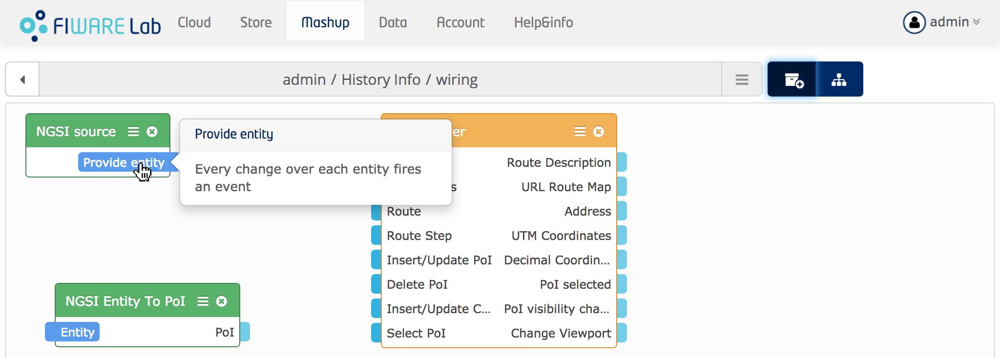
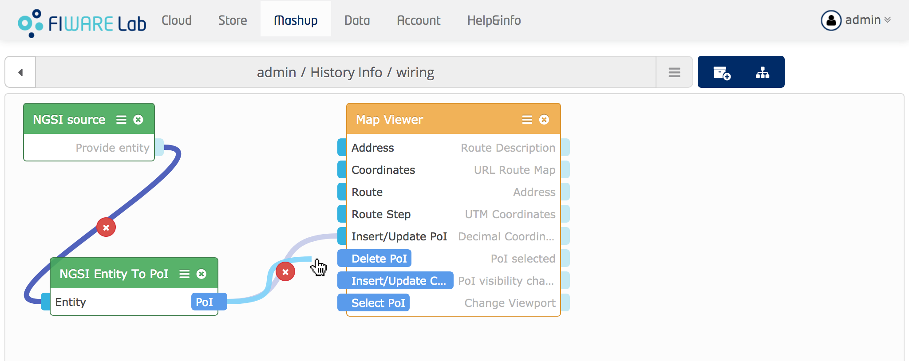
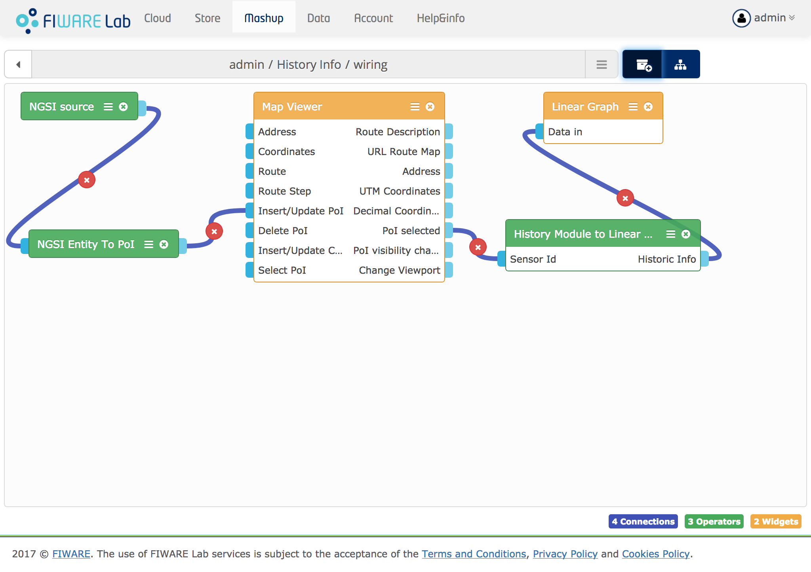
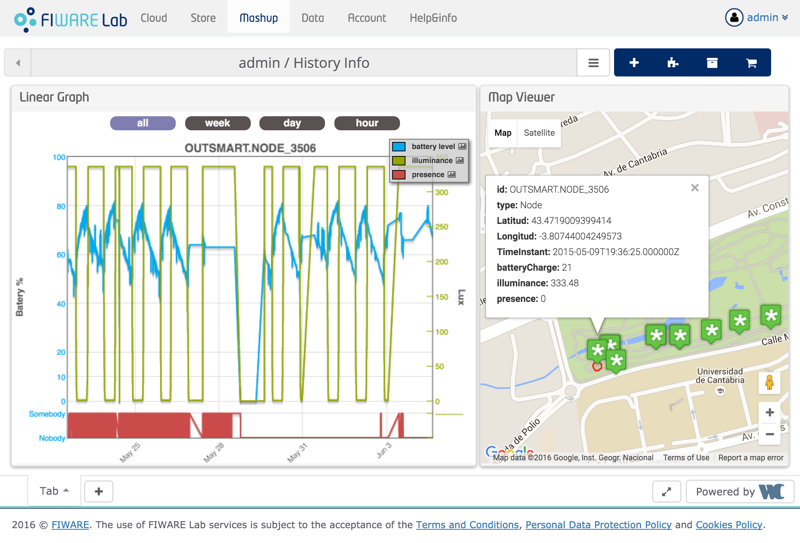

<h2>How to interconnect widgets</h2>

The wiring editor allows you to easily connect widgets in a mashup to create a
fully-fledged dashboard with RIA functionality. These widgets can be visually
connected in the wiring editor to the backend services or data sources through
an extendable set of operators, including filters, aggregators, adapters, etc.

The wiring editor comes with a recommendation system for connections that help
you to identify compatible endpoints that could be connected.

Once you have wired all the widgets and operators, you can play with you new
dashboard.

