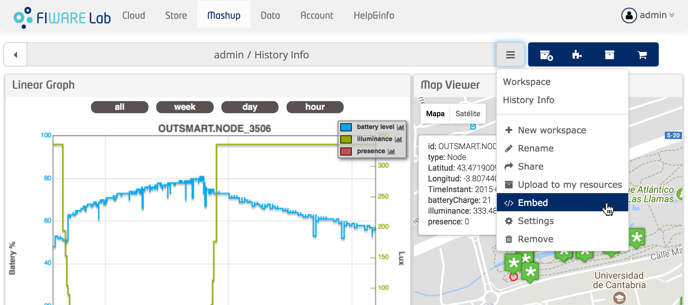
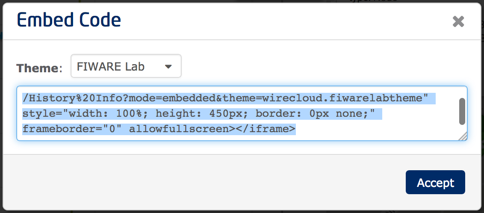

<h2>How to share or sell your dashboard</h2>

Once you are finished with your dashboard, you can either describe and share it
with other people by uploading it to the WireCloud catalogue, or make it
available in the marketplace by creating a new offering. You can even embed the
resulting dashboard in other web pages or sites outside WireCloud by using the
HTML code provided by the platform. For further information regarding how to
create an offering you can refer to the Business API Ecosystem documentation.
The following figures illustrate how to obtain the HTML code needed to embed
your dashboard in external sites:

