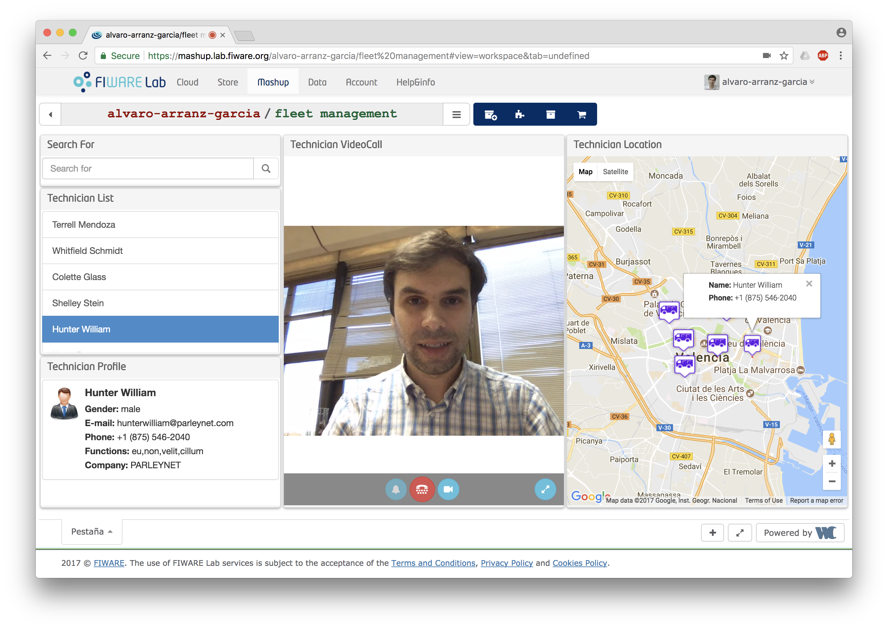
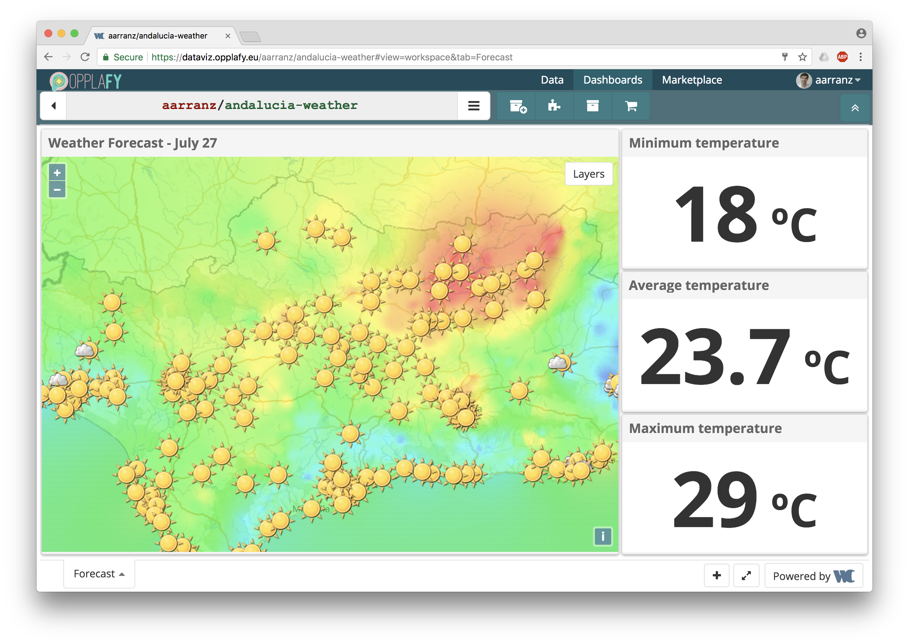
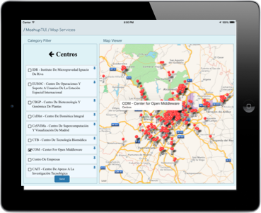

<h2>WireCloud</h2>

WireCloud is a web mashup platform aimed at empowering end users, without
programming skills, to easily create fully-fledged application dashboards built
up from widgets, operators and other pre-existing mashups. These building blocks
have been made available beforehand by developers (and even other end users in
the case of pre-built mashups) in a shared catalogue.

WireCloud offers two different perspectives of use depending on whether you are
a developer or an end user:

-   As a developer, WireCloud allows you to use cutting-edge web technologies
    for easily developing mashable web components, namely widgets and operators,
    and connecting them to backend services (e.g. support for pub/sub,
    “connectors” to a number of FIWARE GEs, etc.) and data sources (e.g. data
    APIs). Once created, WireCloud fosters their shareability and reuse by end
    users.
-   As an end user, WireCloud allows you to develop application dashboards
    without the need of programming skills (e.g. infomediaries, domain experts,
    etc.). These dashboards are created visually by mashing up widgets and
    operators, i.e. integrating heterogeneous data, application logic, and UI
    web components to create value added “instant” applications.

The following screenshots showcases some dashboards created using WireCloud.

 

Usually, those dashboards are build by domain experts by means of mashing up
widgets and operators that were previously developed and shared by other
developers.

WireCloud also offers support for mobile devices, especially for tablets, so
that some of the widgets in an application mashup can be enhanced to support
native features of the device and/or transformed into a native component to
improve their performance when shown in a mobile platform. As an example, the
map in the app dashboard shown in the following screenshot has been
automatically replaced by a native component with better performance and with
access to the GPS features of the tablet.

If you are interested in more details about how to use WireCloud to (a) create
your application dashboard from pre-existing widgets and operators or (b)
develop these widgets and operators check out:

-   [How to find widgets and other components for your dashboard](how-to-find-widgets-and-other-components-for-your-dashboard.md)
-   [How to create your application dashboard from these building blocks](how-to-create-your-application-dashboard-from-these-building-blocks.md)
-   [How to interconnect widgets and connect them to backend resources](how-to-interconnect-widgets-and-connect-them-to-backend-resources.md)
-   [How to share, sell or make available your new dashboard](how-to-share-sell-or-make-available-your-new-dashboard.md)
-   [How to develop new widgets and operators](how-to-develop-new-widgets-and-operators.md)
-   [How to make Ajax requests to external services](how-to-make-ajax-requests-to-external-services.md)
-   [How to receive events](how-to-receive-events.md)
-   [How to send events](how-to-send-events.md)
-   [How to use other FIWARE GEs from your widgets and operators](how-to-use-other-fiware-ges-from-your-widgets-and-operators.md)

If you want to start experimenting and doing hands-on work, have a look at:

-   [WireCloud GEri](http://github.com/fiware/apps.wirecloud)
